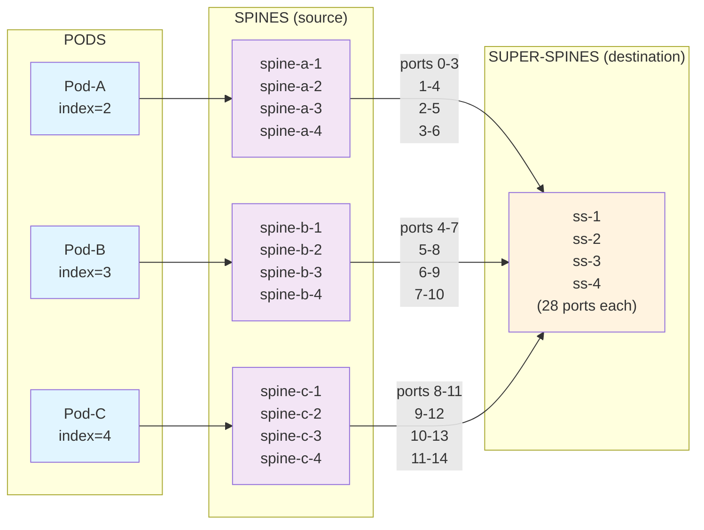
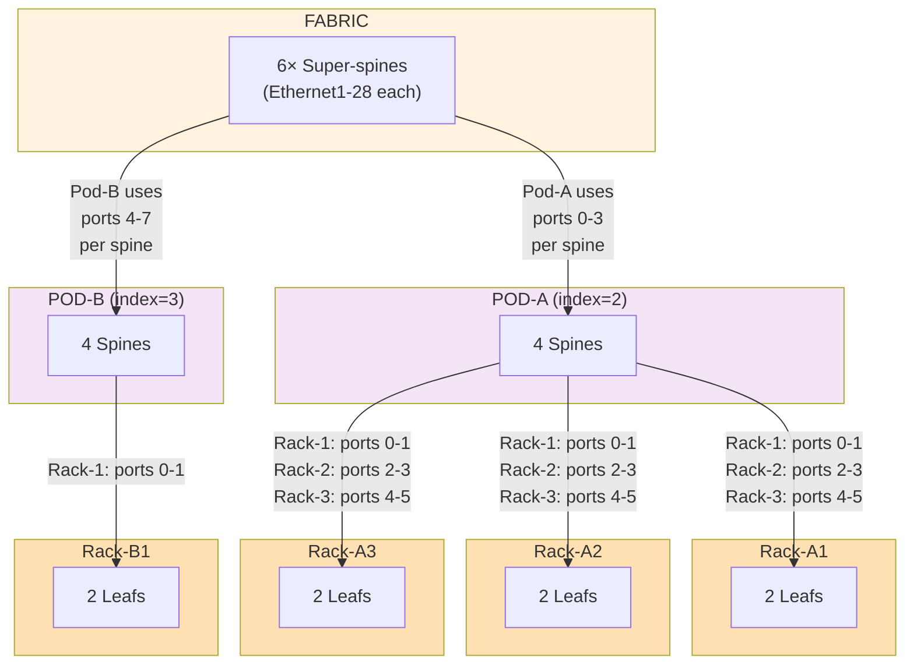

import Mermaid from '@theme/Mermaid';

## Overview

The cabling mechanism ensures deterministic, collision-free connectivity at scale. Instead of manually assigning interfaces, the solution uses **index-based algorithms** that mathematically allocate interfaces to each device.

This section explains the two critical formulas and why they matter.

## The Cabling Problem

Imagine this scenario:

**You have**:
- 2 pods, each with 4 spines
- 6 super-spines (28 spine-facing ports each)
- All spines need to connect to all super-spines

**Naive approach fails**:
```
Pod-A spine-1 → super-spine-1 port 1
Pod-A spine-2 → super-spine-1 port 1  ❌ COLLISION!
```

Without logic, connections overlap. You need **deterministic allocation**: same inputs → same outputs, no conflicts.

## Pod-Level Cabling Algorithm

Connects spines to super-spines using **pod index**:

```
dst_interface_base_index = (pod_index - 2) * len(dst_interface_map)
```

### Formula Breakdown

**`pod_index`**: Unique number for each pod (2, 3, 4, 5...).
- Why start at 2? Pod index 1 is "fabric" pod (contains super-spines, doesn't generate)
- Thus: CPU/storage pods start at 2

**`len(dst_interface_map)`**: Number of super-spines.
- Each super-spine has 28 ports for spines
- With N super-spines, allocate N interfaces per spine

**`dst_interface_base_index`**: Starting interface for this pod.

### Example

**4 super-spines × 28 spine-ports each**:

```
Pod-A (index=2): base_index = (2-2) × 4 = 0
  spine-pod-a2-1 → uses super-spine ports [0, 1, 2, 3]
  spine-pod-a2-2 → uses super-spine ports [1, 2, 3, 4]  ← Shifted by 1
  spine-pod-a2-3 → uses super-spine ports [2, 3, 4, 5]  ← Shifted by 2
  spine-pod-a2-4 → uses super-spine ports [3, 4, 5, 6]  ← Shifted by 3

Pod-B (index=3): base_index = (3-2) × 4 = 4
  spine-pod-b2-1 → uses super-spine ports [4, 5, 6, 7]
  spine-pod-b2-2 → uses super-spine ports [5, 6, 7, 8]  ← Shifted by 1
  spine-pod-b2-3 → uses super-spine ports [6, 7, 8, 9]  ← Shifted by 2
  spine-pod-b2-4 → uses super-spine ports [7, 8, 9, 10] ← Shifted by 3

Pod-C (index=4): base_index = (4-2) × 4 = 8
  spine-pod-c2-1 → uses super-spine ports [8, 9, 10, 11]
  ...
```

**No collisions**: Each pod uses different port ranges. Each spine within a pod shifts by 1.

### Full Cabling Pattern



### Code Implementation

From `src/solution_ai_dc/cabling.py`:

```python
def build_pod_cabling_plan(
    pod_index: int,
    src_interface_map: dict[NetworkDevice, list[NetworkInterface]],
    dst_interface_map: dict[NetworkDevice, list[NetworkInterface]],
) -> list[tuple[NetworkInterface, NetworkInterface]]:
    """Build cabling plan using pod index"""

    dst_devices = list(dst_interface_map.keys())
    dst_device_count = len(dst_devices)
    dst_interface_base_index = (pod_index - 2) * len(dst_interface_map)
    src_index = 0

    cabling_plan = []

    for src_interfaces in src_interface_map.values():  # For each spine
        dst_interface_index = dst_interface_base_index + src_index

        for dst_index, src_interface in enumerate(src_interfaces[:dst_device_count]):
            # Select destination super-spine interface
            dst_interface = dst_interface_map[dst_devices[dst_index]][dst_interface_index]
            cabling_plan.append((src_interface, dst_interface))

        src_index += 1  # Shift for next spine

    return cabling_plan
```

**Walk through**:
1. `dst_device_count` = 4 (4 super-spines)
2. `dst_interface_base_index = (2-2) × 4 = 0` for Pod-A
3. For each spine (4 spines):
   - spine-1: use base_index 0
   - spine-2: use base_index 1 (src_index incremented)
   - spine-3: use base_index 2
   - spine-4: use base_index 3
4. For each super-spine, use calculated interface index

Result: Full mesh, no collisions.

## Rack-Level Cabling Algorithm

Connects leafs to spines using **rack index** and **device index**:

```
start = (rack_index * 2) - 2
end = start + 2
dst_interface = dst_interface_map[dst_devices[dst_index]][start:end][src_device_index - 1]
```

### Formula Breakdown

**`rack_index`**: Unique number for each rack (1, 2, 3, ...).

**`(rack_index * 2) - 2`**: Start interface for this rack.
- Rack-1: start = 0, uses ports 0-1
- Rack-2: start = 2, uses ports 2-3
- Rack-3: start = 4, uses ports 4-5
- **Each rack gets 2-interface window** (no matter how many spines)

**`[start:end]`**: Slice to 2-port window.

**`src_device_index - 1`**: Select which port in window.
- Device index 1 (first leaf): uses port 0 of window
- Device index 2 (second leaf): uses port 1 of window

### Example

**4 spines × 27 leaf-ports each, 10 racks with 2 leafs per rack**:

```
Rack-1 (index=1): window = [0:2]
  leaf-...-1-1 (device_index=1) → spine ports [0, 0, 0, 0]
  leaf-...-1-2 (device_index=2) → spine ports [1, 1, 1, 1]

Rack-2 (index=2): window = [2:4]
  leaf-...-2-1 (device_index=1) → spine ports [2, 2, 2, 2]
  leaf-...-2-2 (device_index=2) → spine ports [3, 3, 3, 3]

Rack-3 (index=3): window = [4:6]
  leaf-...-3-1 (device_index=1) → spine ports [4, 4, 4, 4]
  leaf-...-3-2 (device_index=2) → spine ports [5, 5, 5, 5]

...

Rack-10 (index=10): window = [18:20]
  leaf-...-10-1 (device_index=1) → spine ports [18, 18, 18, 18]
  leaf-...-10-2 (device_index=2) → spine ports [19, 19, 19, 19]
```

**No collisions**: Each rack pair gets unique 2-port window.

### Code Implementation

From `src/solution_ai_dc/cabling.py`:

```python
def build_rack_cabling_plan(
    rack_index: int,
    src_interface_map: dict[NetworkDevice, list[NetworkInterface]],
    dst_interface_map: dict[NetworkDevice, list[NetworkInterface]],
) -> list[tuple[NetworkInterface, NetworkInterface]]:
    """Build cabling plan using rack and device indexes"""

    cabling_plan = []
    dst_devices = list(dst_interface_map.keys())
    dst_device_count = len(dst_devices)

    for src_device, src_interfaces in src_interface_map.items():
        src_device_index = src_device.index.value  # 1 or 2 for dual-leaf racks

        for dst_index, src_interface in enumerate(src_interfaces[:dst_device_count]):
            start = (rack_index * 2) - 2
            end = start + 2
            # Select from 2-port window, using device index
            dst_interface = dst_interface_map[dst_devices[dst_index]][start:end][src_device_index - 1]
            cabling_plan.append((src_interface, dst_interface))

    return cabling_plan
```

**Walk through**:
1. For Rack-2 (index=2): start=2, end=4
2. For each leaf (2 leafs):
   - leaf-1 (device_index=1): uses port [2:4][0] = port 2
   - leaf-2 (device_index=2): uses port [2:4][1] = port 3
3. Repeat for each spine (all get same port indices)

Result: Full mesh with no collisions across racks.

## Topology Visualization

Complete example: 1 fabric, 2 pods, 3 racks per pod, 2 leafs per rack:



## Scalability: The Math Works

Adding new pods/racks doesn't break existing allocations:

**Add Pod-D (index=5)**:
- New base_index = (5-2) × 4 = 12
- Spines use super-spine ports 12-15 (never used before)
- Existing pods unaffected

**Add Rack-11**:
- New window = [20:22]
- All spines get ports 20-21 (never used before)
- Existing racks unaffected

This is why the solution scales to hundreds of racks without manual re-cabling.

## Interface Sorting

The algorithms assume interfaces are sorted consistently. From `src/solution_ai_dc/sorting.py`:

```python
def create_sorted_device_interface_map(
    interfaces: list[NetworkInterface],
) -> dict[NetworkDevice, list[NetworkInterface]]:
    """Sort interfaces ascending: Ethernet1, Ethernet2, ..."""
    interface_map = defaultdict(list)
    for interface in interfaces:
        interface_map[interface.device].append(interface)

    for device_id in interface_map:
        interface_map[device_id] = netutils.interface.sort_interface_list(
            interface_map[device_id], order="asc"
        )

    return interface_map

def create_reverse_sorted_device_interface_map(
    interfaces: list[NetworkInterface],
) -> dict[NetworkDevice, list[NetworkInterface]]:
    """Sort interfaces descending: Ethernet28, Ethernet27, ..."""
    # Same as above but order="desc"
```

Why configurable?
- **Ascending**: Use ports front-to-back for aesthetic consistency
- **Descending**: Use ports back-to-front if hardware has uplinks at end
- Both are deterministic (same input → same order)

## Real-World Implications

### Cable Installation

The solution generates CSV cabling plans:

```
source_device,source_interface,dest_device,dest_interface
spine-pod-a2-1,Ethernet28,ss-fabric-a-1,Ethernet1
spine-pod-a2-1,Ethernet29,ss-fabric-a-2,Ethernet1
spine-pod-a2-1,Ethernet30,ss-fabric-a-3,Ethernet1
spine-pod-a2-1,Ethernet31,ss-fabric-a-4,Ethernet1
spine-pod-a2-2,Ethernet28,ss-fabric-a-1,Ethernet2
spine-pod-a2-2,Ethernet29,ss-fabric-a-2,Ethernet2
...
leaf-pod-a2-1-1,Ethernet27,spine-pod-a2-1,Ethernet1
leaf-pod-a2-1-1,Ethernet28,spine-pod-a2-2,Ethernet1
leaf-pod-a2-1-1,Ethernet29,spine-pod-a2-3,Ethernet1
leaf-pod-a2-1-1,Ethernet30,spine-pod-a2-4,Ethernet1
leaf-pod-a2-1-2,Ethernet27,spine-pod-a2-1,Ethernet2
...
```

Cable teams use this CSV directly. No surprises, perfect prediction.

### Design Changes

Change `amount_of_spines` from 4 to 6:
- Pod cabling algorithm: base_index unchanged
- But now 6 super-spine ports per spine available
- PodGenerator auto-recables all spines
- All leafs still use same rack windows (no recabling)

Change `amount_of_leafs` from 2 to 4:
- RackGenerator creates 4 leaves
- But still uses same 2-port windows per spine?
- **Actually: Algorithm assumes pairs!**

:::warning
Current cabling assumes a maximum of 2 leafs per rack. Changing to 4 would require algorithm revision.
:::

## Why This Matters for Customers

**For scaling from 1 to 100 datacenters**:
- Write cabling once (formula)
- Instantiate design 100 times (different values)
- Guaranteed identical topology every time
- No manual error introduction

**For evolving designs**:
- Change pod count: formula handles it
- Change super-spines: formula handles it
- No "special cases" in the cabling code

**For troubleshooting**:
- Any missing cable → deterministic formula finds it
- Predict cables before build
- Cable installation is 100% predictable

## Next Steps

Now you understand the technical depth of how Infrahub enables deterministic infrastructure at scale. The [Design-Driven Approach](/docs/ai-datacenter/design-driven) section explains why this matters for your business.

:::tip
The cabling algorithms are the most technically complex part. They're also the least likely to need changes. Once tested, they work forever across any pod/rack count.
:::
