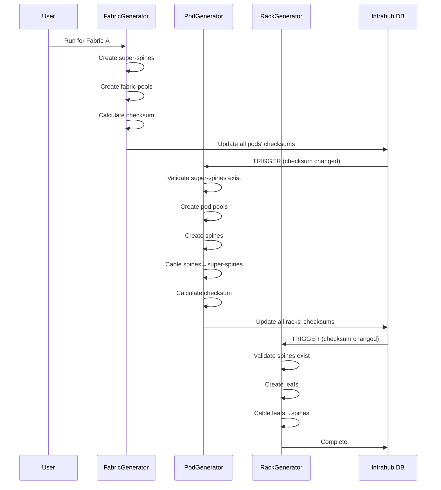

import Mermaid from '@theme/Mermaid';

## Overview

Generators are the automation engine. Three generators work in sequence to create a complete fabric:

1. **FabricGenerator**: Creates super-spines and top-level IP infrastructure
2. **PodGenerator**: Creates spines and connects to super-spines
3. **RackGenerator**: Creates leafs and connects to spines

Each depends on its parent completing first.

## Generator Architecture

### Base Classes

All generators inherit from Infrahub SDK's `InfrahubGenerator` base class:

```python
from infrahub_sdk.generator import InfrahubGenerator

class FabricGenerator(InfrahubGenerator, GeneratorMixin):
    async def generate(self, data: dict) -> None:
        # Parse input data
        # Query related objects
        # Create devices and connections
        # Calculate and propagate checksums
```

The `generate()` method is the entry point. It receives data from the Infrahub platform and:
1. Parses input (which fabric/pod/rack is being generated)
2. Queries related objects (parent templates, pools, devices)
3. Creates devices and infrastructure
4. Propagates checksums to trigger child generators

### GeneratorMixin: Checksum Calculation

Custom mixin provides checksum calculation for change tracking:

```python
class GeneratorMixin:
    def calculate_checksum(self) -> str:
        """Hash all objects touched during generation"""
        related_ids = (
            self.client.group_context.related_group_ids +
            self.client.group_context.related_node_ids
        )
        sorted_ids = sorted(related_ids)
        joined = "".join(sorted_ids)
        return hashlib.sha256(joined.encode("utf-8")).hexdigest()
```

Checksums track which objects were involved in generation. If checksum changes, it signals parent has updated and child should regenerate.

## FabricGenerator: Foundation Layer

Creates super-spine switches and establishes IP infrastructure for the entire fabric.

### Input & Data

```python
async def generate(self, data: dict) -> None:
    data: FabricGeneratorQuery = FabricGeneratorQuery(**data)

    # Extract input parameters
    fabric_name = data.network_fabric.edges[0].node.name.value
    amount_of_super_spines = data.network_fabric.edges[0].node.amount_of_super_spines.value
    super_spine_template_id = data.network_fabric.edges[0].node.super_spine_switch_template.node.id
    fabric_interface_sorting_method = data.network_fabric.edges[0].node.fabric_interface_sorting_method.value
```

The generator queries the fabric design and extracts:
- Fabric name (used in device naming)
- How many super-spines to create
- Which template to use
- Sorting method for spine connections

### Step 1: Allocate IP Infrastructure

```python
async def allocate_resource_pools(self) -> None:
    """Create fabric-level IP pools for hierarchical allocation"""

    # Get global supernet pool (FabricSupernetPool)
    fabric_supernet_pool = await self.client.get(
        CoreIPPrefixPool, name__value="fabric-supernet-pool"
    )

    # Allocate /19 supernet for this fabric
    fabric_supernet = await self.client.allocate_next_ip_prefix(
        resource_pool=fabric_supernet_pool,
        identifier=fabric_id,
        member_type="prefix",
        prefix_length=19,
        data={"role": "fabric_supernet"},
    )

    # Create fabric-level prefix pool for pod allocation
    fabric_prefix_pool = await self.client.create(
        kind=CoreIPPrefixPool,
        name=f"{fabric_name}-prefix-pool",
        default_prefix_type="IpamIPPrefix",
        default_prefix_length=24,
        ip_namespace={"hfid": ["default"]},
        resources=[fabric_supernet],
    )
    await fabric_prefix_pool.save(allow_upsert=True)

    # Create loopback pool for super-spine loopback addresses
    fabric_loopback_prefix = await self.client.allocate_next_ip_prefix(
        resource_pool=fabric_prefix_pool,
        identifier=fabric_id,
        member_type="address",
        prefix_length=27,
        data={"role": "fabric_loopback"},
    )

    loopback_pool = await self.client.create(
        kind=CoreIPAddressPool,
        name=f"{fabric_name}-loopback-pool",
        default_address_type="IpamIPAddress",
        default_prefix_length=32,
        ip_namespace={"hfid": ["default"]},
        resources=[fabric_loopback_prefix],
    )
    await loopback_pool.save(allow_upsert=True)
```

This creates a hierarchical IP structure:
- **FabricSupernetPool** (global, contains all datacenters)
  - `fabric-a-supernet` (/19)
    - `fabric-a-loopback` (/27 → /32 addresses)
    - `fabric-a-prefix-pool` (for pods to allocate from)

### Step 2: Create Super-Spine Devices

```python
async def create_super_spine_switches(self) -> None:
    """Create all super-spine switches for this fabric"""

    loopback_pool = ...  # From previous step

    for idx in range(1, self.amount_of_super_spines + 1):
        device = await self.client.create(
            NetworkDevice,
            hostname=f"ss-{self.fabric_name}-{idx}",  # e.g., ss-fabric-a-1
            object_template={"id": self.super_spine_template_id},
            loopback_ip=loopback_pool,
            role="super_spine",
            member_of_groups=["devices"],
        )
        await device.save(allow_upsert=True)

        # Activate loopback interface
        device = await self.client.get(
            NetworkDevice, id=device.id, include=["ip_address"]
        )
        loopback_interface = await self.client.get(
            NetworkInterface, device__ids=[device.id], role__value="loopback"
        )
        loopback_interface.status.value = "active"
        loopback_interface.ip_address = device.loopback_ip.id
        await loopback_interface.save(allow_upsert=True)
```

For each super-spine:
1. Create device from template with name `ss-fabric-a-{N}`
2. Assign loopback IP from pool
3. Find loopback interface and activate it
4. Link interface to assigned IP

### Step 3: Propagate Checksum to Pods

```python
async def update_checksum(self) -> None:
    """Notify child pods that fabric has changed"""

    checksum = self.calculate_checksum()

    pods = await self.client.filters(
        kind=NetworkPod, parent__ids=[self.fabric_id]
    )

    for pod in pods:
        if pod.checksum.value != checksum:
            pod.checksum.value = checksum
            await pod.save(allow_upsert=True)
            self.logger.info(f"Pod {pod.name.value} updated to checksum {checksum}")
```

When fabric generation completes:
1. Calculate checksum of fabric configuration
2. Query all child pods
3. Update each pod's checksum
4. **Child pods' checksums changing triggers PodGenerator automatically**

## PodGenerator: Scaling Out

Creates spine switches for a pod and connects them to the fabric's super-spines.

### Validation: Ensure Parent Complete

```python
async def generate(self, data: dict) -> None:
    data: PodGeneratorQuery = PodGeneratorQuery(**data)

    self.pod_name = data.network_pod.edges[0].node.name.value
    self.pod_index = data.network_pod.edges[0].node.index.value
    self.amount_of_spines = data.network_pod.edges[0].node.amount_of_spines.value

    # CRITICAL: Verify fabric is fully generated
    await self.get_super_spine_switches_for_fabric()

    if self.fabric_amount_of_super_spines != len(self.super_spine_switches):
        raise RuntimeError(
            f"Fabric doesn't seem fully generated yet! "
            f"Expected {self.fabric_amount_of_super_spines} super-spines, "
            f"found {len(self.super_spine_switches)}"
        )
```

Before proceeding, check:
- Parent fabric's super-spines exist
- All expected super-spines are created
- Pod role is not "fabric" (excluded from generation)

This prevents cascading errors if parent generator didn't complete.

### Allocate Pod-Level Resources

Pods get their own IP pools:

```python
async def allocate_resource_pools(self) -> None:
    """Allocate IP space for this pod from fabric pools"""

    # Get fabric's prefix pool
    fabric_prefix_pool = await self.client.get(
        CoreIPPrefixPool, name__value=f"{self.fabric_name}-prefix-pool"
    )

    # Allocate /19 pod supernet
    pod_supernet = await self.client.allocate_next_ip_prefix(
        resource_pool=fabric_prefix_pool,
        identifier=self.pod_id,
        member_type="prefix",
        prefix_length=19,
        data={"role": "pod_supernet"},
    )

    # Create pod-level prefix pool
    self.pod_prefix_pool = await self.client.create(
        kind=CoreIPPrefixPool,
        name=f"{self.fabric_name}-{self.pod_name}-prefix-pool",
        default_prefix_type="IpamIPPrefix",
        default_prefix_length=24,
        ip_namespace={"hfid": ["default"]},
        resources=[pod_supernet],
    )

    # Allocate loopback pool for spine loopback addresses
    pod_loopback_prefix = await self.client.allocate_next_ip_prefix(
        resource_pool=self.pod_prefix_pool,
        identifier=str(self.pod_id),
        member_type="address",
        prefix_length=27,
        data={"role": "pod_loopback"},
    )

    self.loopback_pool = await self.client.create(
        kind=CoreIPAddressPool,
        name=f"{self.fabric_name}-{self.pod_name}-loopback-pool",
        default_address_type="IpamIPAddress",
        default_prefix_length=32,
        ip_namespace={"hfid": ["default"]},
        resources=[pod_loopback_prefix],
    )
```

Pods inherit from fabric's pools:
- `fabric-a-prefix-pool` (/19)
  - `fabric-a-pod-a2-prefix-pool` (/19 allocated from parent)
    - `fabric-a-pod-a2-loopback-pool` (/27 for spine loopbacks)

This enables **RackGenerator to reuse pod pools** without re-allocating.

### Create Spine Switches

Similar to FabricGenerator but pull loopback from pod pool:

```python
async def create_spine_switches(self) -> None:
    for idx in range(1, self.amount_of_spines + 1):
        device = await self.client.create(
            NetworkDevice,
            hostname=f"spine-{self.pod_name}-{idx}",
            object_template={"id": self.pod_spine_switch_template},
            pod={"id": self.pod_id},
            loopback_ip=self.loopback_pool,
            role="spine",
            member_of_groups=["devices"],
        )
```

Spines are named `spine-pod-a2-1`, `spine-pod-a2-2`, etc., and pulled from pod's loopback pool.

### Connect Spine to Super-Spine

This is where **index-based cabling** applies:

```python
async def connect_spine_to_super_spine(self) -> None:
    # Get spine interfaces (source, with role="super_spine")
    spine_interfaces = await self.client.filters(
        kind=NetworkInterface,
        device__ids=[spine.id for spine in self.spine_switches],
        role__value="super_spine"
    )
    spine_interface_map = self.spine_interface_sorting_function(spine_interfaces)

    # Get super-spine interfaces (destination, with role="spine")
    super_spine_interfaces = await self.client.filters(
        kind=NetworkInterface,
        device__ids=[ss.id for ss in self.super_spine_switches],
        role__value="spine"
    )
    super_spine_interface_map = self.fabric_interface_sorting_function(super_spine_interfaces)

    # Build cabling plan using pod index
    cabling_plan = build_pod_cabling_plan(
        pod_index=self.pod_index,
        src_interface_map=spine_interface_map,
        dst_interface_map=super_spine_interface_map,
    )

    # Create actual links and assign P2P IPs
    await connect_interface_maps(
        client=self.client,
        logger=self.logger,
        cabling_plan=cabling_plan
    )

    await assign_ip_addresses_to_p2p_connections(
        client=self.client,
        logger=self.logger,
        connections=cabling_plan,
        prefix_len=31,
        prefix_role="pod_super_spine_spine",
        pool=self.pod_prefix_pool,
    )
```

The `pod_index` determines which super-spine interfaces each spine connects to. This prevents collisions across pods.

## RackGenerator: Leaf-Level Deployment

Creates leaf switches for a rack and connects them to pod spines.

### Retrieve Parent Resources

Unlike PodGenerator, RackGenerator doesn't create new pools—it reuses pod's:

```python
async def generate(self, data: dict) -> None:
    data: RackGeneratorQuery = RackGeneratorQuery(**data)

    # Extract rack info
    rack_index = data.location_rack.edges[0].node.index.value
    amount_of_leafs = data.location_rack.edges[0].node.amount_of_leafs.value

    # Get parent pod
    pod = await self.client.get(
        kind=NetworkPod, id=rack_pod_id, include=["loopback_pool", "prefix_pool"]
    )
    self.loopback_pool = pod.loopback_pool
    self.prefix_pool = pod.prefix_pool
```

Racks inherit pools from parent pods. No new pool creation needed.

### Create Leaf Switches

Leafs include **device index** (1 or 2) for cabling:

```python
async def create_leaf_switches(self) -> None:
    for idx in range(1, self.amount_of_leafs + 1):
        device = await self.client.create(
            NetworkDevice,
            hostname=f"leaf-{self.pod_name}-{self.rack_index}-{idx}",
            object_template={"id": self.rack_leaf_template_id},
            index=idx,  # CRITICAL for cabling algorithm
            rack={"id": self.rack_id},
            loopback_ip=self.loopback_pool,
            role="leaf",
            member_of_groups=["devices"],
        )
```

Device index (1 or 2) is crucial. RackGenerator's cabling algorithm uses it to select which spine interface each leaf connects to.

### Connect Leaf to Spine

```python
async def connect_leaf_to_spine(self) -> None:
    leaf_interfaces = await self.client.filters(
        kind=NetworkInterface,
        device__ids=[leaf.id for leaf in self.leaf_switches],
        role__value="spine"
    )
    leaf_interface_map = self.leaf_interface_sorting_function(leaf_interfaces)

    spine_interfaces = await self.client.filters(
        kind=NetworkInterface,
        device__ids=[spine.id for spine in self.spine_switches],
        role__value="leaf"
    )
    spine_interface_map = self.spine_interface_sorting_function(spine_interfaces)

    # Build cabling using rack_index and device index
    cabling_plan = build_rack_cabling_plan(
        rack_index=self.rack_index,
        src_interface_map=leaf_interface_map,
        dst_interface_map=spine_interface_map,
    )

    await connect_interface_maps(
        client=self.client,
        logger=self.logger,
        cabling_plan=cabling_plan
    )

    await assign_ip_addresses_to_p2p_connections(
        client=self.client,
        logger=self.logger,
        connections=cabling_plan,
        prefix_len=31,
        prefix_role="rack_spine_leaf",
        pool=self.prefix_pool,  # Uses pod's pool
    )
```

Rack and device indexes determine which spine interfaces each leaf uses. No pool creation, just IP assignment.

## Generator Execution Flow



## Checksum-Driven Automation

The magic: checksums trigger cascading generation.

```mermaid
graph LR
    A["Design Change<br/>amount_of_super_spines: 4→6"]
    B["FabricGenerator<br/>Creates 2 new<br/>super-spines"]
    C["Checksum Changed<br/>Pod A, Pod B, Pod C"]
    D["PodGenerators<br/>Auto-trigger<br/>Re-cable all spines"]
    E["All Pods'<br/>Checksum Changed"]
    F["RackGenerators<br/>Auto-trigger<br/>Re-cable all leafs"]

    A -->|user edit| B
    B -->|updates| C
    C -->|detected by| D
    D -->|updates| E
    E -->|detected by| F
    F -->|Complete<br/>Full fabric updated| G["New Topology<br/>Active"]

    style A fill:#ffccbc
    style B fill:#fff3e0
    style D fill:#fff3e0
    style F fill:#fff3e0
    style G fill:#c8e6c9
```



With event triggers enabled, changing `amount_of_super_spines` from 4 to 6:

1. User edits Fabric-A
2. FabricGenerator runs (manual or triggered)
3. Creates 2 new super-spines
4. Calculates checksum
5. Updates all child pods with new checksum
6. **Pods detect checksum change → PodGenerator auto-runs**
7. PodGenerator recables all spines (now 6 super-spine ports available)
8. Updates all child racks with new checksum
9. **Racks detect checksum change → RackGenerator auto-runs**
10. RackGenerator recables all leafs to new spine layout

**Result**: Complete fabric update without manual intervention.

## Idempotency: Safe Re-runs

All generators use `allow_upsert=True`:

```python
await device.save(allow_upsert=True)
await network_link.save(allow_upsert=True)
```

This means:
- Running generator twice = same result (idempotent)
- Fixing IP pools and re-running updates everything
- No duplicate creation

You can safely re-run generators.

## Shared Utilities

Generators use common Python modules:

### Cabling Algorithm (`src/solution_ai_dc/cabling.py`)

```python
def build_pod_cabling_plan(pod_index, src_interface_map, dst_interface_map):
    """Return list of (spine_interface, super_spine_interface) tuples"""

def build_rack_cabling_plan(rack_index, src_interface_map, dst_interface_map):
    """Return list of (leaf_interface, spine_interface) tuples"""

async def connect_interface_maps(client, logger, cabling_plan):
    """Create NetworkLink objects for each tuple pair"""
```

### IP Assignment (`src/solution_ai_dc/addressing.py`)

```python
async def assign_ip_addresses_to_p2p_connections(
    client, logger, connections, prefix_len, prefix_role, pool
):
    """Allocate /31 prefixes for each link connection"""
```

### Interface Sorting (`src/solution_ai_dc/sorting.py`)

```python
def create_sorted_device_interface_map(interfaces):
    """Group interfaces by device, sort ascending"""

def create_reverse_sorted_device_interface_map(interfaces):
    """Group interfaces by device, sort descending"""
```

These are imported and called by generators.

## Next Steps

Generators use **index-based cabling algorithms**. The next section explains how these algorithms prevent collisions and enable deterministic, scalable connectivity.

:::info
Key takeaway: Three generators create a full fabric hierarchy. Checksums link them together. When design changes, all affected generators auto-run. This is Infrahub's generator strength.
:::
