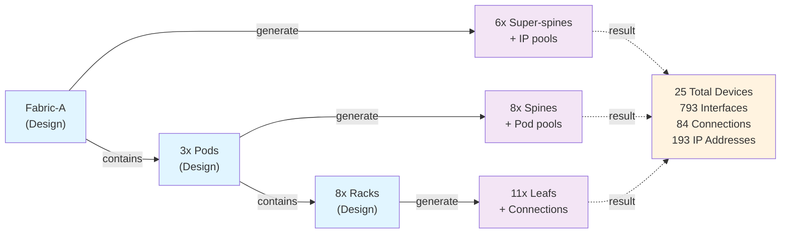

import Mermaid from '@theme/Mermaid';

## Overview

This section walks you through deploying the AI datacenter solution and running your first generator. By the end, you'll have generated a complete fabric with super-spines, spines, and leafs—all from a few lines of configuration.

## Prerequisites

### Required Software

- **Python**: 3.10+ with `uv` installed for dependency management
- **Docker**: For Infrahub deployment
- **Git**: For cloning this repository

### Required Knowledge

- Basic understanding of network topologies (spine-leaf topologies)
- Familiarity with running containerized applications
- Familiarity with YAML configuration format
- Basic understanding of the Python programming language
- Comfort running command-line tools

## Installation

### 1. Install Dependencies

Clone the repository and install Python dependencies:

```bash
git clone https://github.com/opsmill/solution-ai-dc.git
cd solution-ai-dc
uv sync --all-groups --all-extras
```

This installs the Infrahub SDK and any required packages for running generators.

### 2. Build Custom Docker Image

The solution includes a Python package (`solution_ai_dc`) used to share code between generators and transformations. To install this package, build a custom Docker image:

```bash
export INFRAHUB_BASE_VERSION=1.6.1
uv run inv build
```

This command:
- Builds a custom Infrahub image based on the local Infrahub repository
- Installs the `solution_ai_dc` Python package into the image
- Makes shared code (cabling algorithms, IP addressing, interface sorting) available to all generators and transformations

The custom image is tagged as `infrahub-solution-ai-dc:${INFRAHUB_BASE_VERSION}` and will be used when you start Infrahub.

:::info
**Why a custom image?** Infrahub Generators/Transformations/Checks can import shared Python modules using absolute imports (e.g., `from solution_ai_dc import cabling`). The custom image includes the `solution_ai_dc` package so these imports work reliably. This approach is cleaner and more maintainable than relative imports.
:::

**Expected output**: Messages confirming image build completion.

### 3. Start Infrahub

If running locally, use the included helper commands:

```bash
uv run inv start
```

This starts Infrahub using Docker Compose with the custom image. The web UI becomes available at `http://localhost:8000`.

### 4. Load Schemas & Data

The solution includes pre-built schemas and sample data:

```bash
inv load
```

This command:
- Loads all schema definitions from `/schemas/`
- Creates initial objects from `/objects/` (device templates, profiles, IP pools, fabric definitions, groups, ...)
- Creates a repository in Infrahub. The local directory is mounted into the container for quick development iteration.

**Expected output**: Messages confirming successful schema and object creation.

### 5. (Optional) Enable Event Triggers

Event triggers auto-run generators when designs change. They're commented out by default:

```bash
cp objects/20_triggers.yml.save triggers.yml
infrahubctl object load triggers.yml
```

:::note
This step is optional. You can manually run generators via the UI without triggers.
:::

## Your First Generator Run

### Step 1: Open a branch

1. Open Infrahub web UI: `http://localhost:8000`
2. Click the branch selector and create a new branch

### Step 2: Navigate to Generator Actions

1. Open Infrahub web UI: `http://localhost:8000`
2. Click **Actions** (top navigation)
3. Select **Generator Definitions**
4. Find **generate_fabric** in the list

### Step 3: Run the Generator

1. Click the **Run** button next to `generate_fabric`
2. Select a fabric to generate (e.g., **Fabric-A**)
3. Click **Execute**

**What happens next:**
- Generator queries the fabric definition
- Creates 6 super-spine switches with interfaces
- Allocates IP address pools and loopback addresses
- Creates links between devices
- Calculates checksum for pod-level generators and stores them in the pod definitions.

### Step 4: Verify Generation

Navigate to **Network > Devices** and filter by name `ss-` (super-spine prefix):

You'll see 6 new devices:
- `ss-fabric-a-1` through `ss-fabric-a-6`

Each has:
- 28 interfaces (Ethernet1-28)
- Loopback IP address assigned
- Role: `super_spine`
- Member of groups: `devices`, `super-spines`

### Step 5: Cascade to Pods

With FabricGenerator complete, run **generate_pod** for each pod:

1. Go back to **Actions > Generator Definitions**
2. Run `generate_pod`
3. Select **Pod-A2** (first available pod)
4. Execute

**What happens:**
- Creates 4 spine switches for the pod
- Connects each spine to all 6 super-spines
- Allocates IP addresses for spine loopback and P2P links
- Updates Pod-A2 with checksum
- Calculates checksum for rack-level generators and stores them in the rack definitions.

**If triggers enabled**: PodGenerator runs automatically after FabricGenerator completes.

### Step 6: Cascade to Racks

Run **generate_rack** for each rack:

1. Run `generate_rack`
2. Select **Rack-A2-1** (first rack in Pod-A2)
3. Execute

**What happens:**
- Creates 2 leaf switches for the rack
- Connects leafs to all 4 spines
- Allocates /31 prefixes for P2P links

**If triggers enabled**: RackGenerator runs automatically after PodGenerator completes.

## Exploring Generated Infrastructure

### View Generated Devices

Navigate to **Network > Devices**:

```
Fabric level (super-spines):
- ss-fabric-a-1, ss-fabric-a-2, ... ss-fabric-a-6

Pod level (spines):
- spine-pod-a2-1, spine-pod-a2-2, spine-pod-a2-3, spine-pod-a2-4

Rack level (leafs):
- leaf-pod-a2-1-1, leaf-pod-a2-1-2
- leaf-pod-a2-2-1, leaf-pod-a2-2-2
- ... (multiple racks)
```

### View Network Connections

Click any device (e.g., `spine-pod-a2-1`) and view its **Interfaces** tab:

- Interfaces have roles (super_spine, leaf, loopback)
- Interfaces with role=`super_spine` have links to super-spine devices
- Each link shows connected interface and link details

### View IP Allocations

Click a device's interface (e.g., `spine-pod-a2-1 > Ethernet28`), if linked, P2P IP assignment is shown.
The Loopback interface has a /32 address assigned. Addresses come from hierarchical pools

## Proposed change

Navigate to **Proposed Changes* and create a new proposed change, for the branch that we created.
Once diff calculation completes, we can inspect the data diff on the **Data** tab and explore all the infrastructure changes that were made in the branch.

### Artifacts

As part of the proposed change we opened, artifacts have been generated for our newly build fabric:
- device startup configurations
- cabling plan for the fabric

In the **Artifacts** of the Proposed change, we can explore the diffs for all the generated artifacts.
You can also view and download the artifacts:

- For the device startup configuration, navigate to any device and open the **Artifacts** tab
- For the CSV cabling plan, navigate to the fabric and open the **Artifacts** tab

### Merge the proposed change

In the Proposed change **Overview** tab, click the merge button to merge the changes in our branch into the main branch.

## What Was Generated

From one fabric design (Fabric-A with 6 super-spines, 3 pods, 10 racks per pod):



**Key insight**: You declared the design once (3 YAML objects) and generated a full datacenter fabric.

## Making a design change - adding leaf switches to existing racks

Now the power becomes clear. Change the fabric design:

1. Go to **Data > Logical Design > Fabrics**
2. Edit **Fabric-A**
3. Change `amount_of_super_spines` from `6` to `8`
4. Save

**What happens next:**

If triggers enabled:
- FabricGenerator auto-runs
- Creates 2 new super-spines (ss-fabric-a-7, ss-fabric-a-8)
- Updates pod checksums
- PodGenerator auto-runs for all pods
- All spines reconnect to 8 super-spines instead of 6
- RackGenerator auto-runs
- All leaf-to-spine connections updated

**Zero manual re-cabling**: All connections recalculated algorithmically.

## Next Steps

You've seen the power of design-driven infrastructure. To understand how it works:

- **[Schema Deep-Dive](/docs/ai-datacenter/schema)**: Understand the data model
- **[Generator Chain](/docs/ai-datacenter/generators)**: How each generator works
- **[Cabling Indexes](/docs/ai-datacenter/cabling-indexes)**: The algorithm for deterministic cabling
- **[Design-Driven Approach](/docs/ai-datacenter/design-driven)**: Why this matters for your business

:::info
Comfortable with what you see? Jump straight to [Architecture Takeaways](/docs/ai-datacenter/architecture-takeaways) to learn how to extend this for your use case.
:::
