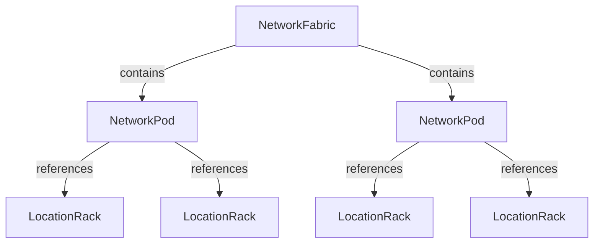

# Design-driven automation

Operators describe what infrastructure should look like; Generators produce it. This page explains how that separation works in the AI/DC solution, what the design objects look like, and why it matters for ongoing operations. See the [Demo Guide](./demo-guide) for hands-on execution and [Modular Generator architecture](./modular-generator-architecture) for how the modular Generators connect.

## What design-driven automation means

### Intent over procedure

Traditional automation encodes *how*: create device X, assign IP Y, cable port Z. The design exists only inside the script — it is consumed during execution and discarded. To understand what was intended, you read code.

Design-driven automation encodes *what*: "this fabric has 6 super spines." The *how* is the Generator's job. The design persists as structured data in Infrahub — queryable, versionable, and auditable — independent of whether Generators have run. An operator can inspect the intended state of a rack at any time without reading Generator code.

### Schema as design language

The bundle's schema makes design intent machine-readable. Each schema node type represents a level in the data center hierarchy:

- `NetworkFabric` — the top level, defining super spine counts and templates
- `NetworkPod` — the middle level, defining spine counts, roles, and templates
- `LocationRack` — the bottom level, defining rack type, leaf counts, and templates

Relationships encode topology: a Fabric contains Pods, Pods reference Racks. Device templates (`CoreObjectTemplate`) capture interface layouts per device role — Generators use these to stamp out devices with the correct ports and interface profiles.

:::info Schema reference
The design hierarchy is defined in `schemas/logical_design.yml` (Fabric and Pod) and `schemas/physical_location.yml` (Rack). See [Installation & Setup: Schemas](./installation-setup#schemas) for the full schema file list.
:::

### Generators read design, produce infrastructure

A Generator reads design objects via a GraphQL query and creates implementation objects — devices, IP allocations, links. Each Generator owns one hierarchy layer:

- **FabricGenerator** reads `NetworkFabric` → produces super spine devices, fabric IP pools
- **PodGenerator** reads `NetworkPod` → produces spine devices, spine-to-super-spine links
- **RackGenerator** reads `LocationRack` → produces leaf devices, leaf-to-spine links

Generators are idempotent: running one again produces the same result, creating only what is missing. If the design changes, a Generator rebuilds only its scope — other layers remain untouched. Generators also connect through triggers: the output of one tier triggers the next, building a full data center from a single action. See [Modular Generator architecture](./modular-generator-architecture) for how the modular Generators work and [Generator patterns](./generator-patterns) for implementation details.

## The design in this bundle

### The Fabric-Pod-Rack hierarchy

The AI/DC solution organizes design intent into three levels, each owning a layer of the data center topology:

- **Fabric** — super spine count, super spine switch template
- **Pod** — spine count, role, spine switch template
- **Rack** — rack type, leaf count, leaf switch template

Each level carries enough information for its Generator to produce a complete set of devices, IP allocations, and links — without knowledge of the layers above or below.

### What operators define

**Design hierarchy objects:**

| Design object   | Key attributes                                          | Example from demo data                                             |
|-----------------|---------------------------------------------------------|--------------------------------------------------------------------|
| `NetworkFabric` | `amount_of_super_spines`, `super_spine_switch_template` | Fabric-A: 6 super spines, `super-spine-switch` template            |
| `NetworkPod`    | `amount_of_spines`, `role`, `spine_switch_template`     | Pod-A2: 4 spines, role `cpu`, `spine-switch` template              |
| `LocationRack`  | `rack_type`, `amount_of_leafs`, `leaf_switch_template`  | Rack-A2-1: type `compute`, 2 leafs, `leaf-switch-compute` template |

**Supporting design objects:**

| Design object    | Purpose                                                     | Example                                                                        |
|------------------|-------------------------------------------------------------|--------------------------------------------------------------------------------|
| Device templates | Interface layouts and port-role assignments per device role | `spine-switch`: Loopback0 + Ethernet ranges with leaf and super-spine profiles |
| IP supernet      | Top-level address space for all allocations                 | `10.0.0.0/8` with role `supernet`                                              |
| Prefix pool      | Allocates fabric subnets from the supernet                  | `FabricSupernetPool` → one /16 per fabric                                      |

:::tip Data files
The design objects above are loaded from the `objects/` directory. Device templates are defined in `objects/06_device_template.yml`, IP resources in `objects/04_ipam.yml`, and the hierarchy in `objects/10_fabric.yml` and `objects/11_rack.yml`. See [Installation & Setup: Demo data](./installation-setup#demo-data-object-files) for the full file list.
:::

### What Generators produce

| Generator       | Reads           | Produces                                                                                                         |
|-----------------|-----------------|------------------------------------------------------------------------------------------------------------------|
| FabricGenerator | `NetworkFabric` | Fabric supernet prefix, super spine loopback pool, super spine devices with loopback IPs                         |
| PodGenerator    | `NetworkPod`    | Pod supernet prefix, pod loopback pool, spine devices with loopback IPs, spine-to-super-spine links with /31 IPs |
| RackGenerator   | `LocationRack`  | Leaf devices with loopback IPs, leaf-to-spine links with /31 IPs                                                 |

The demo defines 24 hierarchy objects (2 fabrics, 6 pods, 16 racks), 9 device templates, and 1 IP supernet with a prefix pool. From these inputs, the Generators produce devices across both fabrics, hierarchical IP pool trees, hundreds of links with point-to-point addressing, and computed attributes on every interface.

:::info Hands-on walkthrough
The [Demo Guide](./demo-guide) walks through each Generator's output step by step. This section focuses on the mapping between design and implementation.
:::

## Why this matters for day-two operations

Design-driven automation is not only about the initial build — the stronger differentiator is what happens afterward.

1. **Design persists after Generators run.** Fabric, Pod, and Rack objects remain in Infrahub as queryable data. An operator can inspect "what was this rack designed to look like" at any time, independent of the devices that were generated from it.
2. **Changes are scoped.** Adding a rack means creating one `LocationRack` object and running the RackGenerator for that rack. Existing racks, devices, links, and IP allocations remain untouched.
3. **Design is versionable.** Changes happen on branches with diffs, reviews, and merges — the same workflow used for configuration changes. There is a full audit trail from design intent through to generated infrastructure.

:::tip Try it
The [Demo Guide: Day-two operations](./demo-guide#day-two-operations-adding-a-rack) walks through adding a rack and running the RackGenerator to see scoped generation in action.
:::

## Learn more

For deeper coverage of the concepts and patterns introduced on this page:

- [Infrahub documentation: Generators](https://docs.infrahub.app/topics/generator)
- [Infrahub documentation: Resource Manager](https://docs.infrahub.app/topics/resource-manager)
- [Modular Generator architecture](./modular-generator-architecture)
- [Generator patterns](./generator-patterns)
