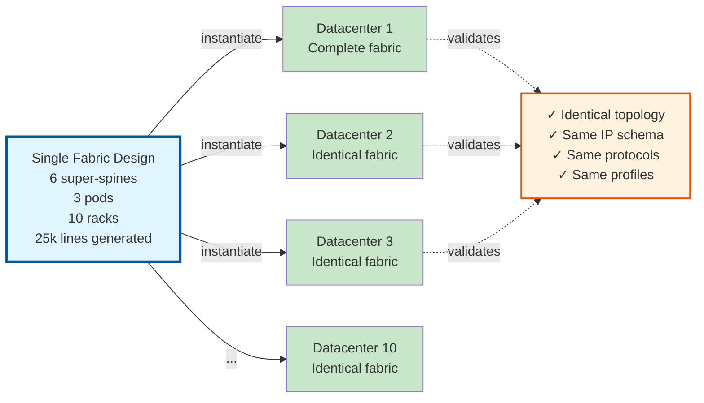
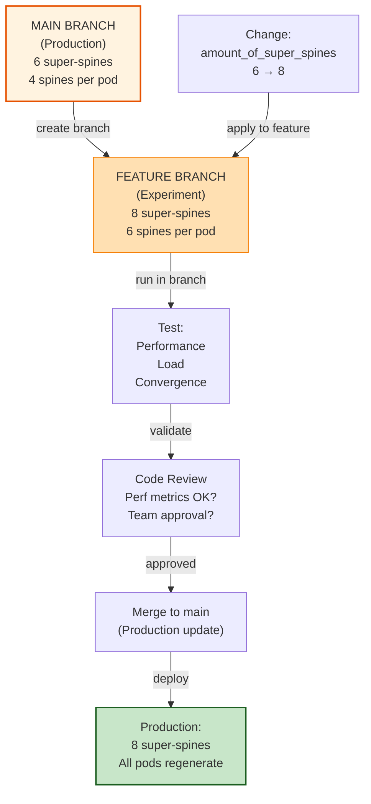
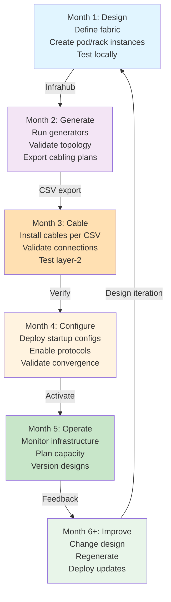

import Mermaid from '@theme/Mermaid';

## The Design-Driven Paradigm

Traditional datacenter deployment:

```
Manual provisioning
    ↓
Ad-hoc configuration
    ↓
Snowflake implementations
    ↓
Years to evolve
```

Design-driven approach:

```
Define design once
    ↓
Generate many consistent implementations
    ↓
Evolve design → implementations auto-update
    ↓
Months to deploy at massive scale
```

## One Design, Many Datacenters

The power of this solution: **define once, instantiate many**.



**Traditional approach**: Design 1 datacenter, document it, hope next team follows specs. Result: drift, inconsistency, troubleshooting hell.

**Design-driven approach**: Design 1 datacenter, Infrahub generates 10 identical implementations. Result: identical behavior across all 10.

## Flexible Schema: Business + Technical

Infrastructure isn't just technical. It's business too.

Default schema captures technical requirements:

```yaml
- name: Pod
  attributes:
    - amount_of_spines
    - role (cpu/storage/fabric)
    - interface_sorting_method
  relationships:
    - loopback_pool
    - prefix_pool
```

**Extend for business**:

```yaml
- name: Pod
  attributes:
    # Technical (as above)
    - amount_of_spines
    # Business (add these)
    - cost_center (e.g., "Marketing", "Research")
    - owner_team (e.g., "Infrastructure Team")
    - sla_tier (e.g., "production", "development")
    - energy_budget (e.g., 500kW)
    - compliance_level (e.g., "PCI-DSS", "HIPAA")
```

**Why powerful**: Single schema describes infrastructure **and** governance. Generators can access both. Reports can filter by cost center or compliance level.

### Extension Example

Add budget tracking to fabric design:

```yaml
# Define once in schema
- name: Fabric
  attributes:
    - name: total_capex_budget
      kind: Number
      optional: true
    - name: annual_opex_budget
      kind: Number
      optional: true

    # Connect to cost allocation
  relationships:
    - name: cost_owner
      peer: OrganizationTeam
      cardinality: one
```

Now each fabric tracks:
- Its own design (super-spine count, etc.)
- Its budget (capex/opex)
- Its owner (billing accountability)

Generators can use this to emit cost reports alongside infrastructure code.

## Templates: Reusable Patterns

Templates define interface structure once, use infinite times:

```yaml
CoreObjectTemplate:
  - name: spine-switch
    description: "Spine with 27 leaf ports, 4 super-spine uplinks"
    nodes:
      - kind: NetworkDevice
        data:
          device_type: PowerSwitch-S9250-1
          name: "{{ device_name }}"
        relationships:
          interfaces:
            - name: Ethernet[1-27]
              profile: profile-spine-downlink
              role: leaf
              mtu: 9000
            - name: Ethernet[28-31]
              profile: profile-spine-uplink
              role: super_spine
              mtu: 9000
            - name: Loopback0
              profile: profile-loopback
```

**Usage**:
- Pod-A: 4 spines from template
- Pod-B: 4 spines from template
- Pod-C: 4 spines from template
- **Total: 12 spine devices, 1 template**

**Evolution**:

Hardware vendor releases new switch (S9260):
- Update template: change device_type, add ports 32-36
- Regenerate all pods
- Existing spines: reuse (old model)
- New spines: use new model

**Result**: Mixed hardware deployment managed through templates. No scripts.

### Profile Composition

Profiles define interface properties:

```yaml
CoreInterfaceProfile:
  - name: profile-spine-downlink
    mtu: 9000
    status: inactive
    description: "Spine facing leafs"
    # Generators activate these

  - name: profile-spine-uplink
    mtu: 9000
    status: inactive
    description: "Spine facing super-spines"

  - name: profile-loopback
    mtu: 65535
    status: inactive
    description: "Router loopback"
```

**Change MTU across all interfaces** (site-wide policy):

1. Edit profile: mtu 9000 → 9216
2. Regenerate fabric
3. All interfaces get new MTU

**Without templates**: Update 1000+ interfaces manually. Error-prone, slow.

**With templates**: One change, one regenerate, 100% consistency.

## Branches: Safe Design Evolution

Infrahub branches allow safe experimentation:



**Scenario**: Current design uses 6 super-spines. Performance tests suggest 8 needed.

**Branch workflow**:

1. Create feature branch from main
2. Change `amount_of_super_spines` to 8
3. Generators run in branch (no production impact)
4. Perf team tests: convergence, load, failover
5. Results reviewed by infrastructure team
6. Decision: merge to main
7. Main gets updated: all pods regenerate with 8 super-spines
8. Deploy to production (no downtime with proper orchestration)

**Benefits**:
- No impact on production during testing
- Full topology preview before deployment
- Team can review changes before production
- **Design evolution is safe, predictable**

## Beyond Fabric Generation

### Cabling Plans (Transform)

Generates CSV for network operations teams:

```csv
source_device,source_port,dest_device,dest_port,cable_medium
spine-pod-a2-1,Ethernet28,ss-fabric-a-1,Ethernet1,mmf
spine-pod-a2-1,Ethernet29,ss-fabric-a-2,Ethernet1,mmf
leaf-pod-a2-1-1,Ethernet27,spine-pod-a2-1,Ethernet1,copper
```

Cable teams use this directly. No interpretation needed.

### Interface Descriptions (Transform)

Auto-generates descriptions from connectivity:

```
Interface: spine-pod-a2-1 Ethernet28
Description: Connected to ss-fabric-a-1 Ethernet1
Status: Active
```

Devices come pre-documented. No manual descriptions.

### Startup Configs (Transform)

Generates device configs from design:

```
! Generated from design: Fabric-A, Pod-A2
!
interface Loopback0
 ip address 10.0.2.1 255.255.255.255
 description "Spine loopback"
!
interface Ethernet28
 ip address 10.0.2.100 255.255.255.254
 description "Connected to ss-fabric-a-1"
 no shutdown
!
router ospf 65000
 network 10.0.0.0 0.0.255.255 area 0
```

Config generation from design eliminates manual typing. Less human error.

## Extensibility for Custom Use Cases

This solution provides the foundation. Extend for your use case:

### Add Server Provisioning

```yaml
# Extend schema
relationships:
  - name: servers
    peer: ComputeServer
    cardinality: many

# Create ServerGenerator
class ServerGenerator(InfrahubGenerator):
    async def generate(self, data: dict) -> None:
        # Create servers per rack based on rack type
        for rack in racks:
            for i in range(rack.amount_of_servers):
                server = await client.create(
                    ComputeServer,
                    hostname=f"server-{rack.name}-{i}",
                    rack=rack,
                    ip_address=...  # Allocate from IPAM
                )
```

Now one design generates network **and** servers.

### Add Storage Cluster Automation

Hook into RackGenerator completion. When leafs are ready, create storage cluster:

```python
# In RackGenerator
await connect_leaf_to_spine()
await create_storage_cluster()  # Custom logic
```

Network follows storage requirements. Or vice versa.

### Connect to External Systems

Generators can call external APIs:

```python
# After fabric generation
await create_hardware_purchase_order(amount_of_super_spines)
await provision_cloud_backup(fabric_id)
await notify_siem_system(fabric_topology)
```

Design → infrastructure → operational systems all synchronized.

## Evolution: From Design to Production



**Without design-driven approach**: Each phase done manually. 9 months, errors, inconsistency.

**With design-driven approach**: Phases parallel where possible, automation reduces errors, consistency guaranteed.

## Why Infrahub

This solution exists because **Infrahub provides the foundation**:

1. **Flexible Schema**: Store business + technical data together
2. **Generators**: Transform schema → infrastructure
3. **Templates**: Define patterns once, instantiate many
4. **Branches**: Safe experimentation
5. **Transforms**: Generate outputs (CSVs, configs, docs)
6. **Traceability**: Full history of which design generated which implementation

Without Infrahub, you'd build custom tooling for each piece. Infrahub provides it all.

## Business Impact

**Speed to deployment**: 3 months → 1 month (10x faster)

**Cost of ownership**: Same technical team manages 10x more infrastructure

**Consistency**: Manual process drift eliminated

**Evolution**: Design changes propagate automatically

**Risk**: Tested design template reduces deployment risk

## Next Steps

You now understand why this approach matters. The [Architecture Takeaways](./architecture-takeaways) section provides patterns you can apply to your own infrastructure.

:::info
Key insight: Design-driven infrastructure isn't about technology. It's about managing datacenter complexity through abstraction, consistency, and automation.
:::
