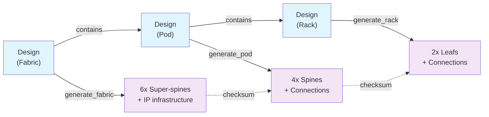

import Mermaid from '@theme/Mermaid';

## Overview

The AI Datacenter solution demonstrates how to build large-scale, repeatable datacenter infrastructure using Infrahub's design-driven automation approach. Instead of manually provisioning hundreds of devices, you define a design once and generate consistent implementations across multiple datacenters.

### What You'll Build

This solution implements an automated network fabric with hierarchical spine-leaf topology:
- **Super-spine layer**: Top-of-fabric redundancy
- **Spine layer**: Pod-level aggregation
- **Leaf layer**: Rack-level access

All generated from declarative design definitions.

### Key Benefits

**Speed**: Generate 500+ devices, 1000+ interfaces, and complex connectivity in minutes instead of days.

**Consistency**: Same design → identical results every time. No snowflake configurations.

**Evolution**: Change the design and all implementations auto-regenerate. New datacenters inherit improvements automatically.

**Repeatability**: Build 10 identical AI datacenters in parallel by instantiating one design multiple times.

### How It Works

### Key Concepts

**Design vs Implementation**: Designs (templates, schemas) remain abstract. Implementations (actual devices, interfaces) are concrete instances generated from designs.

**Hierarchical Generation**: Fabric generator creates super-spines → Pod generator creates spines → Rack generator creates leafs. Each depends on parent completion.

**Index-Based Cabling**: Deterministic algorithms using fabric/rack/device indexes ensure no interface collisions and predictable connectivity patterns.

**Checksum-Driven Automation**: Parent generators propagate checksums to children, auto-triggering re-generation when designs change.

**Flexible Schema**: Infrahub's data model captures both technical (interfaces, IP addresses) and business (cost center, owner) requirements in one schema.

## Documentation Structure

### [Getting Started](./getting-started)

Rapid hands-on tutorial. Install, run first generator, explore results. Takes ~30 minutes.

### [Schema Deep-Dive](./schema)

Understand the data model. How NetworkFabric, NetworkPod, LocationRack, and device templates work together.

### [Generator Chain](./generators)

How automated generation from a design works. Three generators (fabric, pod, rack) and checksum-driven cascading.

### [Cabling Indexes](./cabling-indexes)

Most technical section. Index formulas that enable collision-free, deterministic cabling at scale.

### [Design-Driven Infrastructure](./design-driven)

Why design-driven approach matters. Templates, branches, flexibility, and long-term evolution.

### [Architecture Takeaways](./architecture-takeaways)

Key patterns, extension guidance, performance characteristics, design decisions explained.

## Target Audience

Network Infrastructure architects and engineers building large-scale datacenters. Assumes familiarity with:
- Network concepts (Spine/leaf topologies)
- Infrastructure-as-code principles
- Python and YAML

## Before You Start

You'll need:
- Infrahub instance
- `uv` for Python dependency management
- Docker/docker-compose
