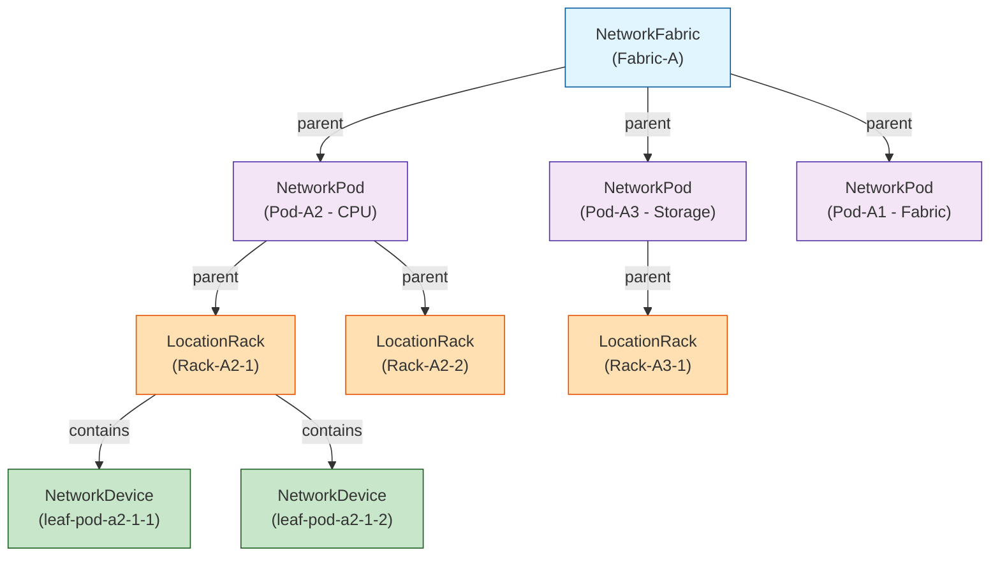
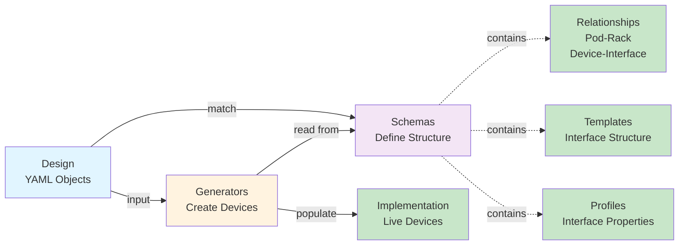

import Mermaid from '@theme/Mermaid';

## Overview

The data model is the foundation for design-driven infrastructure. This section explains how schemas define the structure for fabrics, pods, racks, and network devices, and how Infrahub's flexible schema accommodates both technical and business requirements.

## Hierarchical Design: The Three-Tier Model

The solution implements three hierarchical levels mirroring physical datacenter organization:



Each level inherits properties, contains children, and enables scoped automation.

### NetworkBuildingBlock: Shared Foundation

All design elements inherit from `NetworkBuildingBlock` generic:

```yaml
generics:
  - name: BuildingBlock
    namespace: Network
    hierarchical: true
    attributes:
      - name: name
        kind: Text
        unique: true
        branch: aware
      - name: index
        kind: Number
        branch: agnostic
```

**Shared attributes**:
- `name`: Unique identifier (e.g., "Fabric-A", "Pod-A2", "Rack-A2-1")
- `index`: Numeric order (e.g., Fabric index 1, Pod index 2, Rack index 1)

**Key distinction**:
- `name` is `branch: aware` - different branches can have different names
- `index` is `branch: agnostic` - index is immutable across branches

:::info
This matters for generators. The index is used in cabling algorithms and must be consistent.
:::

## NetworkFabric: Top-Level Design

The fabric node represents the entire datacenter fabric design:

```yaml
- name: Fabric
  namespace: Network
  inherit_from:
    - CoreArtifactTarget  # Enables artifact generation
    - NetworkBuildingBlock
  children: NetworkPod
  attributes:
    - name: amount_of_super_spines
      kind: Number
      default_value: 4
      order_weight: 1000
    - name: fabric_interface_sorting_method
      kind: Dropdown
      choices:
        - create_sorted_device_interface_map
        - create_reverse_sorted_device_interface_map
      default_value: create_sorted_device_interface_map
  relationships:
    - name: super_spine_switch_template
      peer: CoreObjectTemplate
      cardinality: one
```

### Key Attributes

**`amount_of_super_spines`**: How many top-of-fabric switches. Changes here trigger FabricGenerator.

**`fabric_interface_sorting_method`**: Controls which physical ports get used for spine connections. Choices:
- `create_sorted_device_interface_map`: Use ports in order (Ethernet1, Ethernet2, ...)
- `create_reverse_sorted_device_interface_map`: Use ports in reverse (Ethernet28, Ethernet27, ...)

Why? Different hardware cabling preferences and aesthetic consistency.

### Key Relationships

**`super_spine_switch_template`**: References a device template defining super-spine interface structure. Generators use this to create actual devices.

Template example:
```yaml
CoreObjectTemplate:
  - name: super-spine-switch
    nodes:
      - kind: NetworkDevice
        data:
          name: "{{ super_spine_name }}"
          role: super_spine
```

## NetworkPod: Modular Scaling Units

Pods are independent scaling units within a fabric. Think: "Pod for CPU workloads", "Pod for storage workloads".

```yaml
- name: Pod
  namespace: Network
  inherit_from:
    - NetworkBuildingBlock
    - GeneratorTarget  # Enables auto-generation
  parent: NetworkFabric
  attributes:
    - name: amount_of_spines
      kind: Number
      default_value: 4
    - name: role
      kind: Dropdown
      choices: [fabric, cpu, storage]
    - name: leaf_interface_sorting_method
      kind: Dropdown
    - name: spine_interface_sorting_method
      kind: Dropdown
  relationships:
    - name: spine_switch_template
      peer: CoreObjectTemplate
    - name: racks
      peer: LocationRack
      cardinality: many
    - name: loopback_pool
      peer: CoreIPAddressPool
    - name: prefix_pool
      peer: CoreIPPrefixPool
```

### Key Attributes

**`amount_of_spines`**: Number of spine switches in this pod. Used for generator scaling.

**`role`**: Pod purpose - affects which templates/configs apply:
- `fabric`: Special pod containing super-spines (no spine generator runs)
- `cpu`: CPU workload pod
- `storage`: Storage workload pod

**Sorting methods**: Just like fabric, controls interface allocation for spine→leaf connections.

### GeneratorTarget Mixin

The `GeneratorTarget` mixin adds:

```yaml
attributes:
  - name: checksum
    kind: Text
    description: "Hash of generator inputs"
```

Generators calculate checksums and update racks with the checksum. When checksum changes, racks auto-regenerate.

### Key Relationships

**`spine_switch_template`**: Template for creating spine devices.

**`loopback_pool`**: Created by the pod generator. Spine devices pull loopback IPs from this pool.

**`prefix_pool`**: Created by the pod generator. P2P links between spines and super-spines get /31 prefixes from this pool.

## LocationRack: Physical Implementation

Racks are the physical instantiation point. Each rack contains leaf switches:

```yaml
- name: Rack
  namespace: Location
  hierarchical: true
  parent: NetworkPod
  attributes:
    - name: name
      kind: Text
    - name: index
      kind: Number
    - name: rack_type
      kind: Dropdown
      choices: [compute, storage]
    - name: amount_of_leafs
      kind: Number
      default_value: 2
  relationships:
    - name: leaf_switch_template
      peer: CoreObjectTemplate
    - name: pod
      peer: NetworkPod
    - name: devices
      peer: NetworkDevice
      cardinality: many
```

### Key Attributes

**`rack_type`**: Determines which template gets used:
- `compute`: Uses compute-specialized leaf template
- `storage`: Uses storage-specialized leaf template

Different templates mean different interface configurations for servers/storage.

**`amount_of_leafs`**: The amount of leaf switches that should be added to this rack.

**`index`**: Used for cabling. Rack-1, Rack-2, Rack-3 get different spine interface allocations.

## NetworkDevice: Actual Network Devices

Devices are created by generators from templates:

```yaml
- name: Device
  namespace: Network
  hierarchical: false
  attributes:
    - name: hostname
      kind: Text
      unique: true
    - name: role
      kind: Dropdown
      choices: [super_spine, spine, leaf]
    - name: index
      kind: Number
  relationships:
    - name: device_type
      peer: NetworkDeviceType
    - name: pod
      peer: NetworkPod
    - name: rack
      peer: LocationRack
    - name: interfaces
      peer: NetworkInterface
      cardinality: many
    - name: loopback_ip
      peer: IpamIPAddress
```

**Generators populate**:
- `hostname`: Using pattern (e.g., `spine-pod-a2-1`)
- `role`: Super-spine, spine, or leaf
- `index`: Used for cabling
- `interfaces`: Created from device template
- `loopback_ip`: Allocated from Pod loopback pool

## NetworkInterface: Interface Structure

Interfaces are created from device templates and include:

```yaml
- name: Interface
  namespace: Network
  attributes:
    - name: name
      kind: Text  # e.g., "Ethernet1", "Ethernet28"
    - name: description
      kind: Text  # Computed: "Connected to ss-fabric-a-1"
    - name: role
      kind: Dropdown
      choices: [loopback, super_spine, spine, leaf, server, storage]
    - name: status
      kind: Dropdown
      choices: [active, inactive]
    - name: mtu
      kind: Number
      default_value: 9000
  relationships:
    - name: device
      peer: NetworkDevice
    - name: ip_address
      peer: IpamIPAddress
    - name: link
      peer: NetworkLink
```

### Interface Roles

Roles control connectivity logic:
- **loopback**: Special self-interface, gets /32 address from loopback pool
- **super_spine**: Spine→super-spine connector
- **spine**: Leaf→spine connector
- **leaf**: Server-facing
- **server/storage**: Connected to devices outside this solution

Generators filter by role when building cabling plans.

## Templates & Profiles: Reusable Patterns

Rather than defining every device individually, templates define structure:

### Device Templates

Define interface structure once, instantiate many:

```yaml
CoreObjectTemplate:
  - name: spine-switch
    description: "Spine switch with 27 leaf ports, 4 super-spine ports"
    nodes:
      - kind: NetworkDevice
        data:
          device_type: "PowerSwitch-S9250"
          name: "{{ device_name }}"
          role: spine
        relationships:
          interfaces:
            - name: Ethernet[1-27]
              profile: profile-interface-spine
              role: leaf
            - name: Ethernet[28-31]
              profile: profile-interface-spine
              role: super_spine
            - name: Loopback0
              profile: profile-interface-loopback
              role: loopback
```

**Range expansion**: `Ethernet[1-27]` expands to 27 individual interfaces.

### Interface Profiles

Profiles define interface properties:

```yaml
CoreInterfaceProfile:
  - name: profile-interface-spine
    mtu: 9000
    status: inactive  # Activated by generators
    description: "Spine interface"
```

Profiles ensure consistency. When you update the profile of a specific interface role, then all interfaces using the profile will get the new changes applied.

## Data Model Flow

How design becomes infrastructure:



## Branch-Aware vs Branch-Agnostic

Infrahub allows different versions of data on different branches:

**Branch-aware attributes** (`branch: aware`):
- `name`: Can differ between branches
- `amount_of_spines`: Can test 4 vs 6 on a branch
- `sorting_method`: Can experiment with reverse sorting

Branch allows safe design experimentation.

**Branch-agnostic attributes** (`branch: agnostic`):
- `index`: Must be consistent (used in cabling algorithms)
- Generators rely on index for determinism

## Flexible Schema for Business + Technical Data

This schema captures technical requirements. But Infrahub allows extending it for business data:

### Extension Example

Add cost tracking to pods:

```yaml
nodes:
  - name: Pod
    # ... existing schema ...
    attributes:
      - name: cost_center
        kind: Text
        optional: true
      - name: budget_allocated
        kind: Number
        optional: true
```

Or add ownership:

```yaml
relationships:
  - name: owner_team
    peer: OrganizationTeam
    cardinality: one
```

**Why powerful**: Single schema captures infrastructure AND business context. Generators can access both.

## Next Steps

Now that you understand the data model, the [Generator Chain](./generators) section explains how generators use these schemas to create infrastructure automatically.

:::tip
Keep this schema reference handy. The [Cabling Indexes](./cabling-indexes) and [Architecture Takeaways](./architecture-takeaways) sections reference these structure definitions.
:::
